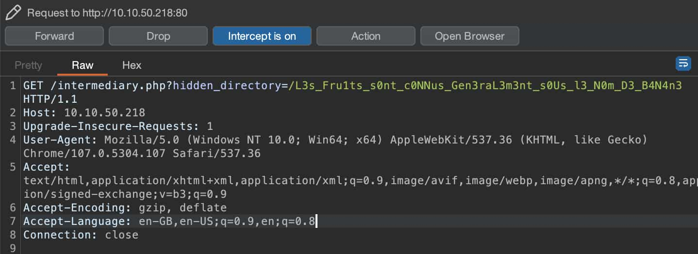
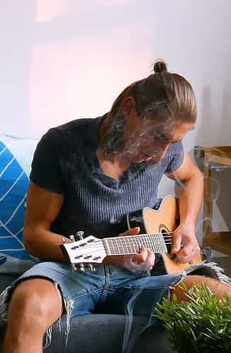
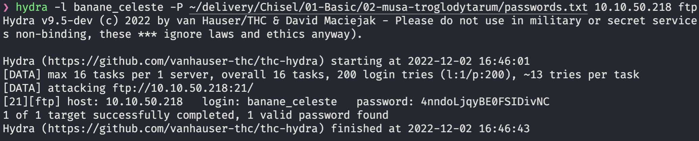
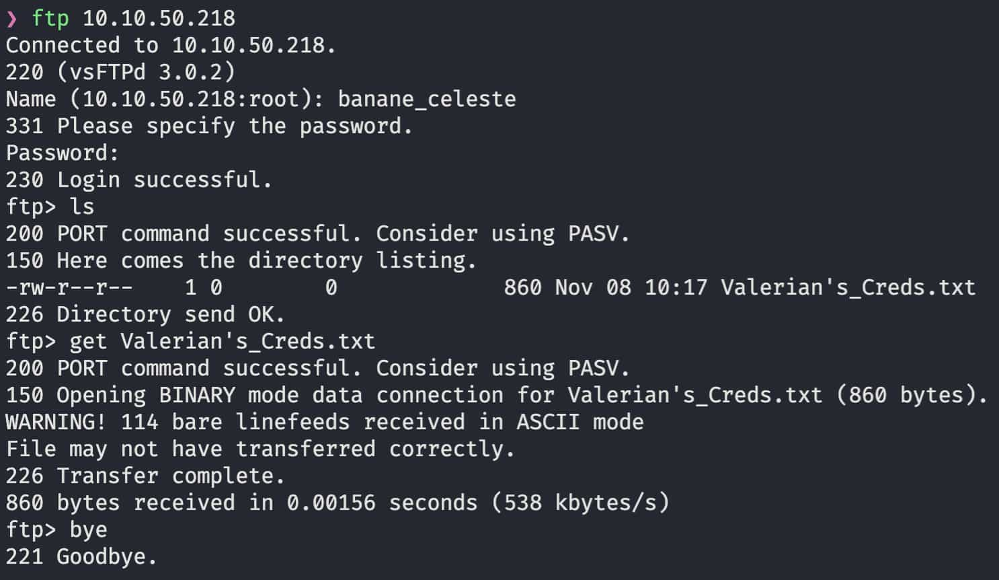
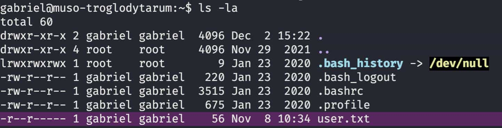

[< Back](../../README.md)

A basic net scan reveals two ssh ports and a http website.
```
Discovered open port 21/tcp on [IP]
Discovered open port 80/tcp on [IP]
Discovered open port 22/tcp on [IP]
```

On the website we find a defaut Apache2 landing page, checking a little further into the html and css inside `/assets/style.css` we find this:
```css
  /* Nice to see someone checking the stylesheets.
     Take a look at the page: /l3_B4n4N13r_D3s_M0nT4gN3s.php
  */
```

Going onto that php script we get redirected to a [youtube video](https://www.youtube.com/watch?v=UUaPsBjYyOk) and we see an alert saying to turn off the Javascript.

After doing so, we land on intermediate page saying:
```
Love it when people block Javascript...
This is happening whether you like it or not... The hint is in the video. If you're stuck here then you're just going to have to bite the bullet!
Make sure your audio is turned up!
```
We also get another version of the youtube video we saw before. After listening to it we find a hint saying that we are looking in the wrong direction.

Going back, we decided to use the interect feature from burp suite to take a closer look at the redirections happening with `/l3_B4n4N13r_D3s_M0nT4gN3s.php`

That's where we find a hidden directory path in plain sight.
<p></p>

Going there we can see a file called `Hot_Babe.jpg`
<p></p>

Using [Aperi'Solve](https://www.aperisolve.com/), a steganography multi-tool we found recently, we can try to see if there are hidden elements in this file.

Hidden at the end of the file is this:
```
Eh, you've earned this. Username for FTP is banane_celeste
One of these is the password:
iVBORw0KGgoAAAANSUhE
UgAAAUYAAAHyCAIAAAAY
[... 198 other password]
YpWHeB28Q5BFw1qswBWj
```
The entire password list can be found in [this file](passwords.txt).

So let's try force brute of the 200 password onto the FTP using hydra:
```
hydra -l banane_celeste -P passwords.txt [IP] ftp
```
<p></p>

So the correct password is: `4nndoLjqyBE0FSIDivNC`.

Let's now connect to the FTP, we find a file named `Valerian's_Creds.txt`, let's download it
<p></p>

The file can be seen [here](Valerian's_Creds.txt). Inside we find some text and a sequence of tabs and spaces. After a long time searching we tried [dcode.fr](dcode.fr) encryption language detection tool.
It came out positive on "Whitespace language", using [their decoder](https://www.dcode.fr/whitespace-language) we get:
```
User: valerian
Password: T4k_t4k_S0lide_Dyn0_int0_Cr1mP
```
Let's try the SSH port from the start.
```
ssh valerian@[IP] -p 22
```

We find a lot of folders, this looks like a GNOME installation. After searching for a while for anything out of place, we found inside `/use/games` a folder named `s3cr3t`.
```sh
> ls -la s3cr3t
-rw-r--r-- 1 root root  156 Nov 29  2021 .th1s_m3ss4ag3_15_f0r_g4br13L_0nly!

> cat s3cr3t/.th1s_m3ss4ag3_15_f0r_g4br13L_0nly!
Your password is awful, Gabriel.
It should be at least 60 characters long! Not just ca_serait_jamais_arrive_en_haskell
Honestly!

Yours sincerely
   -Root
```

Let's try connecting again with user `gabriel`.
```sh
ls -la
```
<p></p>
