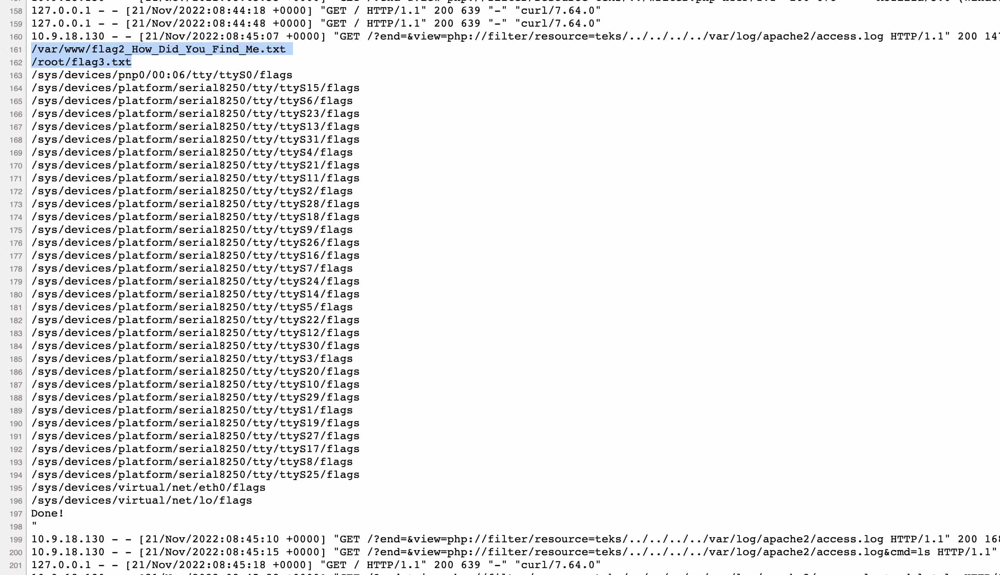

[< Back](../../README.md)

(I actually found root flag before this one)

<!-- Using the absolute power of root, I dit a recursive `grep` for any file that contains the following regex: `*EPI*`. -->

Using the absolute power of root, I did a recursive `find` over everything checking for files named `flag*`

I output it as a log file, because the recursive search makes it long enough to not appear in the apache logs.

I also added a "Done!" that gets appended at the end of the file when the `grep` finishes, as it's really hard to know if it's just stalling or finished.

It's getting pretty messy, so here is the command in bash instead of URL formatted:
```sh
sudo env /bin/bash -c '
  find / -name "flag*" -type f;
  echo "Done!" >> /home/output.txt
'
```

I can now monitor the progress using `ls -la`, checking if size of `/home/output.txt` changes.

This worked flawlessly. :)
<p></p>
