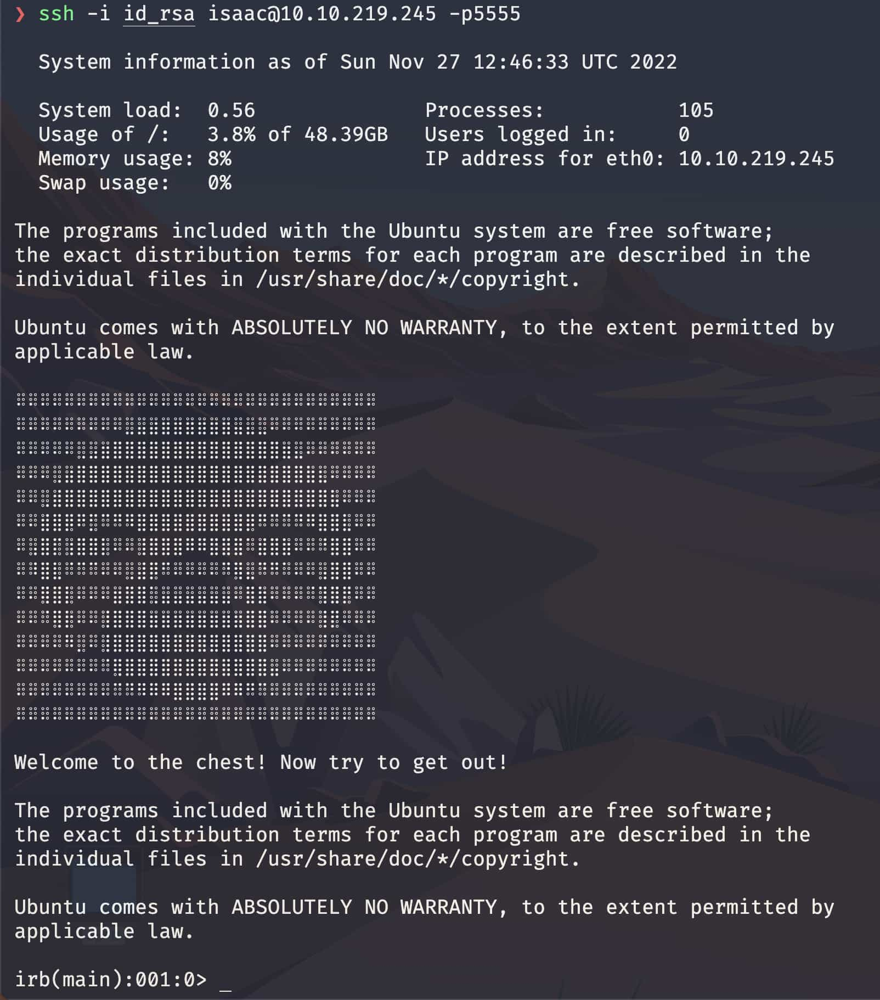
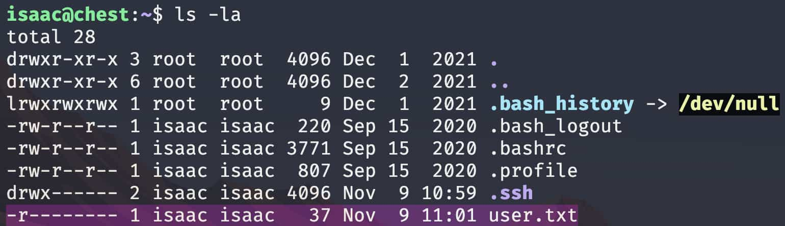

[< Back](../../README.md)

Inside the `chest.zip` found for the flag 1, we also a had a hint.txt that said: `5000-6500`, so let's check those ports out.

But before that, let's grab the private and public ssh keys also found inside the nfs.

```sh
❯ nmap -sV -sC -p5000-6500 [IP]
[...]
5555/tcp open  ssh        OpenSSH 7.6p1 Ubuntu 4ubuntu0.7 (Ubuntu Linux; protocol 2.0)
5734/tcp open  ssh        OpenSSH TzKbaALvf (protocol 46077184)
5855/tcp open  ssh        OpenSSH L (protocol 53662)
5940/tcp open  ssh        Cyberoam UTM firewall sshd (protocol 44797)
6020/tcp open  ssh        MikroTik RouterOS sshd (protocol 10627)
6267/tcp open  ssh        Bitvise WinSSHD y (FlowSsh r; protocol 602150)
[...]
```

We find an array of open ports, let's filter the trash and keep those that seem useful.

I'm also like 99% sure we are searching for an ssh, so that will filter it down even more.

The port 5555 is the one that seems to be the least fake of the bunch, because it has a real protocol version.

We get an ssh port, now we need a username, we tried `isaac` as it's the path name.

```sh
❯ ssh -i home/isaac/.ssh/id_rsa isaac@[IP] -p5555
```

<p></p>

We are in the machine, but also in an interactive ruby shell (A.K.A. irb), we need to somehow either execute code on the machine or get out of the irb.

I tried all the classic CTRL+C CTRL+D, put process to sleep, `exit` `quit()`, nothing worked, I then looked at how to execute shell commands in ruby, in an attempt to run `/bin/bash`.

```ruby
exec '/bin/bash'
```

It worked, and doing an ls, we found the flag:
<p></p>
